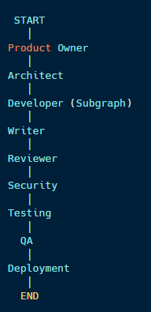
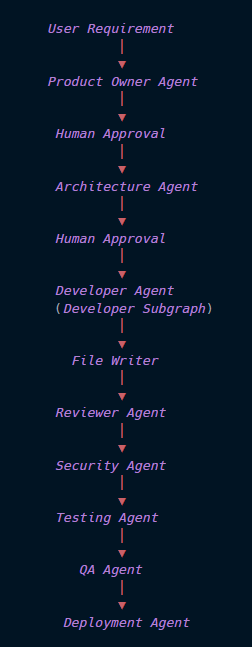
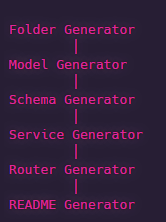
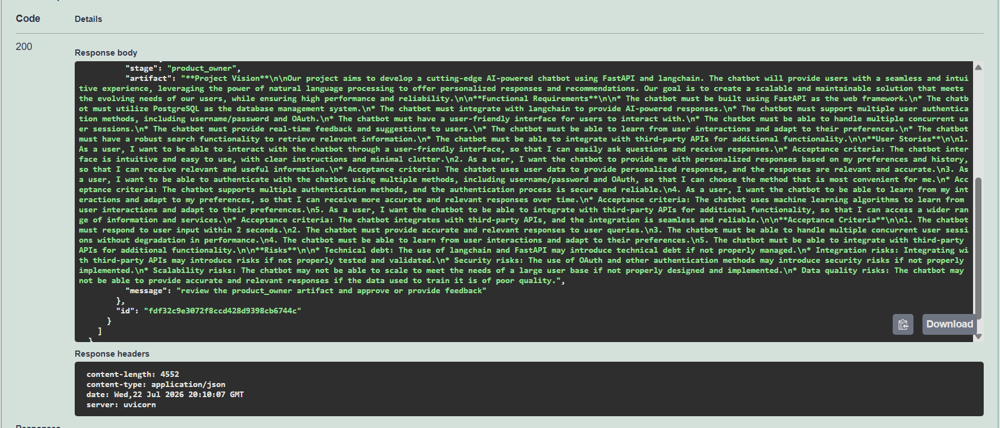
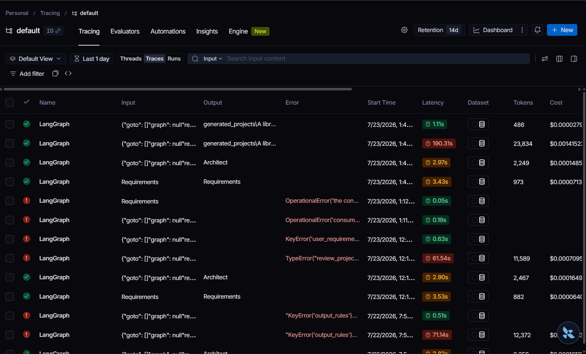
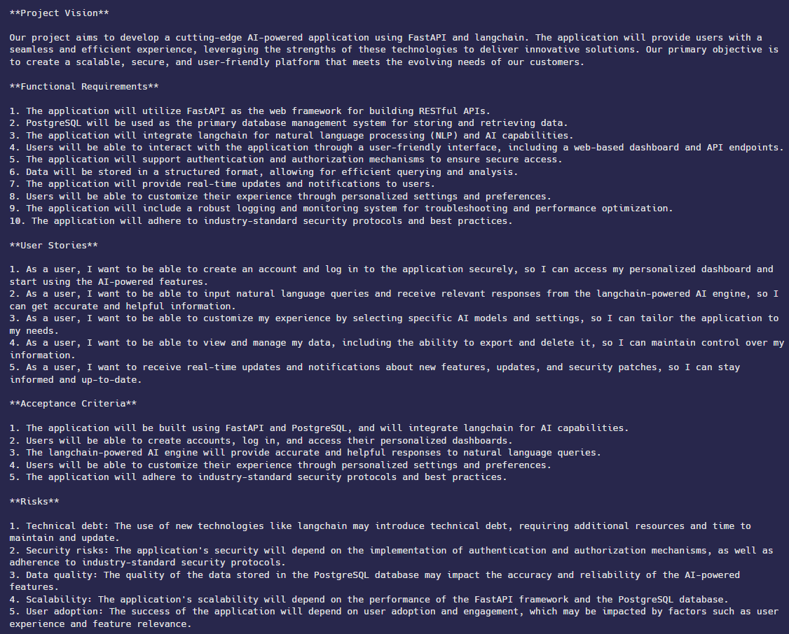
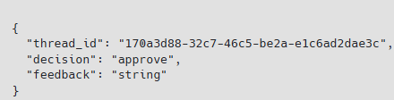

<div align="center">

# 🤖 LangGraph Automated SDLC Workflow

### AI-Powered Multi-Agent Software Development Life Cycle Automation

[]()
[]()
[]()
[]()
[]()

An intelligent multi-agent SDLC automation platform that transforms software requirements into production-ready backend projects using AI agents, Human-in-the-Loop approvals, persistent memory, workflow checkpointing, and automated quality assurance.

---

### 📸 Demo

> **Replace with your demo GIF**


---

### 🏗 Architecture



---

### 🔄 Workflow



---

### 👨‍💻 Developer Subgraph



</div>

---

# 📖 Overview

Software development involves multiple stages, reviews, iterations, and human decisions. This project automates the Software Development Life Cycle (SDLC) using a collaborative team of AI agents built with **LangGraph**.

Each agent specializes in a specific SDLC phase—from gathering requirements to generating backend code, reviewing it, analyzing security, suggesting tests, performing QA, and determining deployment readiness.

The workflow also supports:

- Human approval at critical stages
- Persistent workflow checkpointing
- Long-term memory across sessions
- Full execution tracing
- Automated project generation

---

# ✨ Features

- 🤖 Multi-Agent SDLC Workflow
- 👨 Human-in-the-Loop (HITL)
- 🧠 Long-Term Memory using Mem0
- 💾 Persistent Checkpointing using Neon PostgreSQL
- 📊 LangSmith Workflow Tracing
- ⚡ FastAPI REST API
- 🏗 Developer Subgraph
- 📁 Automatic Backend Project Generation
- 🔍 AI Code Review
- 🔒 Security Analysis
- 🧪 Testing Recommendations
- ✅ QA Validation
- 🚀 Deployment Readiness Assessment

---

# 🧠 Workflow

```text
                 User Requirements
                        │
                        ▼
              Product Owner Agent
                        │
                 Human Approval
                        ▼
              Architecture Agent
                        │
                 Human Approval
                        ▼
               Developer Subgraph
                        │
                        ▼
                  Project Writer
                        │
                        ▼
                Reviewer Agent
                        │
                        ▼
                Security Agent
                        │
                        ▼
                 Testing Agent
                        │
                        ▼
                    QA Agent
                        │
                        ▼
               Deployment Agent
                        │
                        ▼
                      END
```

---

# 🏗 System Architecture

## Main Workflow

```text
START
 │
 ▼
Product Owner
 │
 ▼
Architect
 │
 ▼
Developer
 │
 ▼
Writer
 │
 ▼
Reviewer
 │
 ▼
Security
 │
 ▼
Testing
 │
 ▼
QA
 │
 ▼
Deployment
 │
 ▼
END
```

---

## Developer Subgraph

```text
Folder Generator
        │
        ▼
Model Generator
        │
        ▼
Schema Generator
        │
        ▼
Service Generator
        │
        ▼
Router Generator
        │
        ▼
README Generator
```

---

# 🤖 AI Agents

## 📋 Product Owner

Responsible for converting user requirements into a structured Software Requirements Specification.

**Responsibilities**

- Project Vision
- Functional Requirements
- User Stories
- Acceptance Criteria
- Risk Analysis

Supports Human-in-the-Loop approval and Mem0 memory retrieval.

---

## 🏛 Architect

Designs the overall software architecture.

**Responsibilities**

- System Architecture
- Technology Stack
- Database Design
- API Design
- Folder Structure
- Best Practices

Supports iterative human feedback.

---

## 👨‍💻 Developer

Generates the backend application through a dedicated LangGraph subgraph.

Generates:

- Folder Structure
- SQLAlchemy Models
- Pydantic Schemas
- Services
- FastAPI Routers
- README

---

## 📝 Writer

Creates a complete project directory from generated artifacts.

---

## 🔍 Reviewer

Analyzes generated code for:

- Maintainability
- Readability
- Best Practices
- Code Quality

---

## 🔒 Security

Performs static security review.

Checks for:

- Security Risks
- Input Validation
- Authentication Issues
- Secrets Management
- Common Vulnerabilities

---

## 🧪 Testing

Suggests

- Unit Tests
- Integration Tests
- API Tests
- Edge Cases
- Failure Scenarios

---

## ✅ QA

Aggregates all reports and determines release readiness.

Produces:

- Quality Score
- Release Decision
- Remaining Issues
- Recommendations

---

## 🚀 Deployment

Determines deployment readiness.

Provides:

- Deployment Checklist
- Prerequisites
- Deployment Commands
- Final Recommendation

---

# 🧠 Persistent Memory

This project integrates **Mem0** to remember user preferences across multiple workflow executions.

Example:

```text
User:
"I prefer FastAPI and PostgreSQL."

↓

Stored in Mem0

↓

Retrieved automatically by the Product Owner Agent

↓

Future projects adapt to user preferences
```

---

# 💾 Workflow Checkpointing

Workflow execution is checkpointed using **Neon PostgreSQL**.

Benefits include:

- Resume after interruption
- Human approval support
- Long-running workflows
- Persistent workflow state

---

# 📊 Observability

The workflow is fully traced using **LangSmith**.

Each execution provides:

- Agent Timeline
- Prompt Inspection
- Model Responses
- Latency Analysis
- Error Debugging
- Workflow Visualization

---

# 🛠 Tech Stack

| Category | Technology |
|------------|------------|
| Backend | FastAPI |
| Workflow | LangGraph |
| AI Framework | LangChain |
| LLM Provider | OpenRouter |
| Memory | Mem0 |
| Tracing | LangSmith |
| Database | PostgreSQL (Neon) |
| ORM | SQLAlchemy |
| Validation | Pydantic v2 |
| Language | Python 3.11 |

---

# 📂 Project Structure

```text
app/
│
├── nodes/
│
├── prompts/
│
├── services/
│
├── utils/
│
├── subgraphs/
│   └── developer/
│
├── generated_projects/
│
├── graph.py
├── router.py
├── state.py
├── memory.py
├── checkpointer.py
├── config.py
└── main.py
```

---

# 🚀 Installation

Clone the repository

```bash
git clone https://github.com/<your-username>/LangGraph-Automated-SDLC-Workflow.git
```

Navigate to the project

```bash
cd LangGraph-Automated-SDLC-Workflow
```

Create a virtual environment

```bash
python -m venv .venv
```

Activate the environment

### Windows

```bash
.venv\Scripts\activate
```

### Linux / macOS

```bash
source .venv/bin/activate
```

Install dependencies

```bash
pip install -r requirements.txt
```

---

# ⚙️ Environment Variables

Create a `.env` file.

```env
OPENROUTER_API_KEY=

OPENROUTER_MODEL=

GOOGLE_API_KEY=

DATABASE_URL=

MEM0_API_KEY=

LANGSMITH_API_KEY=

LANGSMITH_TRACING=true
```

---

# ▶️ Running the Application

Start the server

```bash
uvicorn app.main:app --reload
```

Open Swagger UI

```text
http://localhost:8000/docs
```

---

# 📷 Screenshots

## Swagger UI



---

## LangSmith Trace



---

## Generated Project



---

## Human Review



---

# 🎯 Future Improvements

- Parallel Agent Execution
- Frontend Code Generation
- Docker Compose Generation
- Kubernetes Deployment
- CI/CD Pipeline Generation
- GitHub Repository Creation
- Multi-Language Project Generation
- RAG-Based Architecture Validation
- Semantic Code Review
- Authentication & RBAC
- Web Dashboard

---

# 📈 Roadmap

- [x] Multi-Agent Workflow
- [x] Human-in-the-Loop
- [x] Developer Subgraph
- [x] Mem0 Integration
- [x] LangSmith Integration
- [x] PostgreSQL Checkpointing
- [x] Project Generation
- [x] Review Pipeline
- [ ] Docker Deployment
- [ ] Cloud Deployment
- [ ] Frontend Dashboard

---

# 🤝 Contributing

Contributions are welcome!

If you'd like to improve the project:

1. Fork the repository
2. Create a feature branch
3. Commit your changes
4. Open a Pull Request

---

# 📜 License

This project is licensed under the **MIT License**.

See the [LICENSE](LICENSE) file for details.

---

# 🙏 Acknowledgements

This project is built using:

- LangGraph
- LangChain
- FastAPI
- Mem0
- LangSmith
- Neon PostgreSQL
- SQLAlchemy
- OpenRouter

---

<div align="center">

### ⭐ If you found this project useful, consider giving it a star!

Built with ❤️ by **Vansh**

</div>